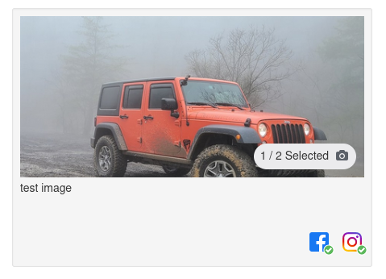
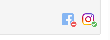
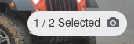
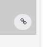

# Vue Frontend
This project is part of the interview with Intech.
To see live, [click here](https://vue-frontend-site.herokuapp.com/).

## Getting Started

Click in the download button and get the .zip file. Extract the contents of the zip file.

Or can clone this repository, just copy the git url and open your terminal and run git clone + repository url:

```
git clone https://github.com/ejgdev/vue-frontend.git
```

### Installing

For install this repository, just need to run this command:

```
npm install
```

### Start the Project
When everything is setup, you can run the project with this command:

```
npm start
```
Then open http://localhost:8080/ to see your app. By default run on port 8080.

## Frontend Test
The backend developer has made an endpoint that returns an array of search results. Write a vue grid component consisting of the search results showing _at most_ 4 results per row. Each child component in the grid should look like the mockup below.

You can use SCSS or CSS for this. We would like to see bootstrap framework version 3.4 used.

## Mockup of one result


## Endpoint Description
```
GET ./json/question1.json
```
Each object consists of:
- The thumbnail url which is the image in the top of the mockup
- A message to display underneath the thumbnail
- A platforms array of objects describing the images in the bottom right of the mockup. It will always have "Facebook" or "Instagram" as the name of these objects. Here is an example of what the icon looks like when `"has_content": false`

  

  The images for the platforms is located in the `images/platforms` folder.


Additionally the section below is based on `format`, `total_assets` and `selected_assets`:



The numerator is the `selected_assets` and the denominator is the `total_assets`. Only formats IMAGE and VIDEO will have this. The others will simply display the icon like so:



The icon to the right varies based on format type. There is only four format types, the font-awesome related icon is given below:
1. TEXT - `fa-pencil`
2. URL - `fa-link`
3. IMAGE - `fa-camera`
4. VIDEO - `fa-video-camera`